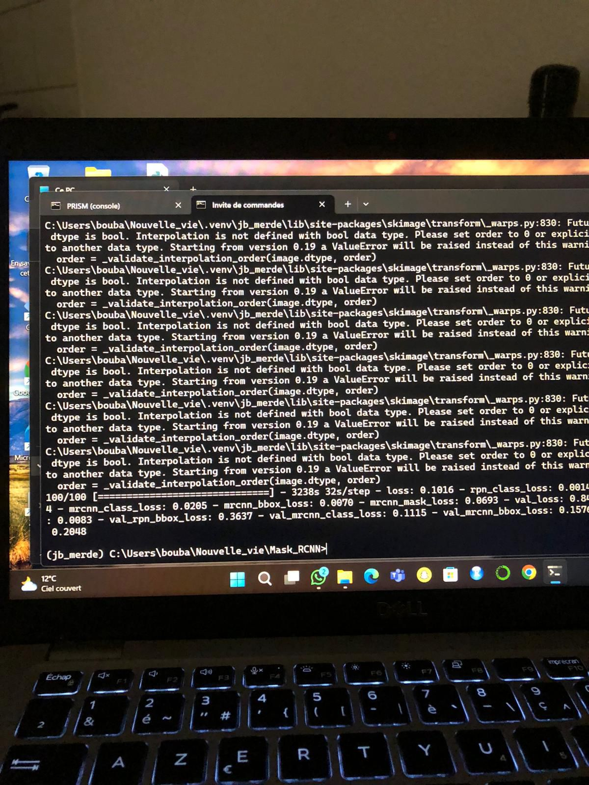

# Projet de Détection d'Objets avec Mask R-CNN

## Auteurs
- **Jean-Baptiste CHEZE -M1 MASERATI**
- **Alpha DIALLO -M1 MASERATI**

---

## Description du Projet
Ce projet consiste à implémenter une détection d'objets utilisant le modèle Mask R-CNN pour identifier et classifier des **lions** et des **tigres** dans des images. Le modèle a été entraîné sur un dataset personnalisé avec des annotations JSON faites manuellement, puis validé sur un dataset séparé.

---

## Où trouver les différents éléments du projet

### Rapport
Le rapport détaillé du projet, incluant le code, les résultats et les explications, est disponible dans le notebook **`testing2.ipynb`**.

### Entraînement
Le script utilisé pour l'entraînement du modèle est **`training2.py`**.

---

## Hyperparamètres Utilisés
Nous avons utilisé les hyperparamètres suivants pour l'entraînement du modèle Mask R-CNN :

- **Nombre de classes :** 3 (arrière-plan, lion, tigre)  
- **Taille des images :** 512x512 pixels  
- **Learning rate :** 0.001  
- **Optimiseur :** Adam  
- **Nombre d'époques :** 10  
- **Nombre d'images par GPU :** 1  
- **Scales des ancres RPN :** (16, 32, 64, 128, 256)  
- **Seuil minimal de confiance pour détection :** 90%  
- **Nombre de pas par époque :** 100  
- **Nombre de validations par époque :** 5  

Ces hyperparamètres ont été ajustés pour équilibrer la performance du modèle et le temps d'entraînement.

---

## Validation Loss et Analyse des Pertes

---

**image pour le train qu'on a reussi à recuperer :**

## Difficultés Rencontrées
Nous, **Jean-Baptiste CHEZE** et **Alpha DIALLO**, avons rencontré plusieurs défis tout au long de ce projet :

1. **Gestion des fichiers JSON :**  
   - Le chargement et le parsing des annotations des images ont été plus compliqués que prévu.  
   - Certains fichiers présentaient des problèmes comme des dimensions manquantes ou des polygones avec des coordonnées hors limites.  
   - Il a fallu vérifier chaque étape pour s'assurer que les données étaient correctement utilisées.  

2. **Compatibilité des librairies :**  
   - Pour que le projet fonctionne, nous avons dû rétrograder toutes les librairies à des versions datant de 2017, notamment TensorFlow et Keras.  
   - Cela a pris du temps et demandé plusieurs ajustements pour assurer la compatibilité avec Mask R-CNN.  

3. **Matrice de confusion :**  
   - La mise en place de la matrice de confusion a également posé des problèmes.  
   - Certaines prédictions n'étaient pas correctement associées aux vérités terrain, nécessitant des ajustements dans le code et la logique d'évaluation.  

Malgré ces difficultés, ce projet a été une expérience formatrice, nous permettant d'approfondir nos compétences en deep learning et gestion de projets complexes.

---

## Comment Contribuer
N'hésitez pas à ouvrir une issue ou à proposer une pull request pour contribuer à ce projet !
